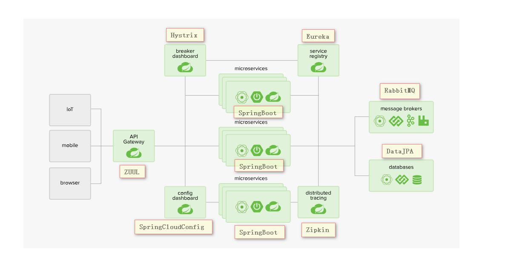

# ***SpringCloud***

# ***面试问题***
* 1.什么是微服务?
* 2.微服务之间是如何独立通讯的?
* 3.SpringCloud与Dubbo有哪些区别?
* 4.对SpringBoot与SpringCloud的理解?
* 5.什么是服务熔断,服务降级?
* 6.微服务的优缺点分别是什么,遇到的问题?
* 7.微服务技术栈有哪些?
* 8.Eureka与Zookeeper都可以提供服务注册与发现,两者的区别是什么?

# ***微服务概述***
## **1.什么是微服务?**
* 微服务是一种架构风格或架构模式,微服务架构风格提倡将单个应用程序划分为一组小的应用,每个服务运行在其独立的自己的进程内,服务之间互相协调,互相配合,为用户提供最终的服务
  服务之间采用轻量级的通信机制互相沟通,(通常是基于HTTP的RESTful API进行通讯), 每个服务都围绕具体的业务进行构建,并且能独立部署到生产环境.
  另外,应尽量避免统一的,集中式的管理来协调这些服务,对具体的服务而言,应根据业务上下文,选择合适的语言,工具对其构建 
  可以有一个轻量级的集中式管理来协调这些服务,可以使用不同的语言来编写服务,也可以使用不同的数据存储(一个服务一个库) 
* 微服务化的核心就是将传统的一站式应用(ALL IN ONE),根据业务拆分为一个一个的服务,彻底的去耦合 
  每一个微服务提供单一的业务功能的服务,一个服务只做一件事(专业的人做专业的事) 
  从技术角度看就是一种小而独立的处理过程,类似进程概念,能够自行独立启动或销毁,并可以拥有自己独立的数据库
* [Martin Fowler个人博客](https://martinfowler.com/articles/microservices.html)
* [微服务中文网](http://blog.cuicc.com/blog/2015/07/22/microservices/)
## **2.微服务与微服务架构**
* 微服务 
  强调的是服务的大小,强调的是一个一个的个体,每个个体完成具体的任务或者功能 
  他关注的是某一个点,是具体的解决某一个问题/提供落地对应服务的一个服务应用(专业的业务需求交给专业的模块来做,这一个模块只做这一个业务需求的事情)
* 微服务架构 
  强调的是整体,使用哪些方式将一个一个的微服务组装拼接起来,构成一个整体,向外提供服务
## **3.微服务优缺点**

| 优点 |
|---|
|每个服务足够内聚,足够小,代码容易理解,这样能够聚焦一个指定的业务功能或业务需求|
| 开发简单,开发效率提高,一个服务可能只做一件事情 |
|微服务能够被小团队独立开发,2~5个人开发团队完成|
|微服务是松耦合的,是有功能意义的服务,无论是在开发阶段还是部署阶段都是独立的|
|微服务可以使用不同的语言开发|
|易于和第三方集成,微服务允许容易和灵活的方式集成自动部署,通过持续集成工具 Jenkins.Hudson.bamboo|
|微服务易于被开发人员理解,修改和维护,|
|微服务允许你利用融合最新技术|
|微服务只是业务逻辑代码,不会和HTML.CSS或其他界面组件混合(前后端分离开发)|
|每一个微服务都有自己的存储能力,可以有自己的数据库,也可以有统一的数据库(一个应用一个库)|

| 缺点 |
|---|
| 开发人员要处理分布式系统的复杂性 |
| 多服务运维难度,随着服务的增加,韵味的压力增大                                                        |
|系统部署依赖|
|服务间的通信成本|
|数据的一致性|
|系统集成测试|
|性能监控|
## **4.微服务技术栈**
* 微服务技术栈:多种技术的集合体
* 微服务技术栈

   |微服务条目|落地技术|
   |---|---|
   |服务开发 |SpringBoot  Spring  SpringMVC|
   |服务配置与管理|Netflix的Archaius 阿里的Diamonddeng|
   |服务注册与发现|Eureka Consul Zookeeper|
   |服务调用|Rest RPC gRPS|
   |服务熔断器|Hystrix Envoy等|
   |负载均衡|Ribbon Nginx等|
   |服务接口调用(客户端调用服务的简化工具)|Feign等|
   |消息队列|RbbitMQ ActiveMQ Kafka|
   |服务配置中心管理|SpringCloudConfig Chef等|
   |服务路由(API网关)|Zuul|
   |服务监控|Zabbix Nagios Metrics Spectator|
   |全链路追踪|Zipkin Brave Dapper|
   |服务部署|Docker OpenStack Kubernetes等|
   |数据流操作开发包|SpringCloudStream(封装Redis RabbitMQ Kafka等发送接收消息)|
   |消息服务总线|SpringCloudBus|
   |...||
## **5.为什么选择SpringCloud作为微服务架构**
* 选型依据
   * 整体解决方案和框架成熟度
   * 社区热度
   * 可维护性
   * 学习曲线
* 微服务对比

| 服务框架 |Netflix/SpringCloud|Motan|gRPC|THirft|Dubbo/DubboX|
|---|---|---|---|---|---|
|功能定位|完整的微服务框架|RPC框架,但整合了ZK或Consul 实现集群环境的基本服务注册/发现|RPC框架|RPC框架|服务框架|
|支持rest|是 Ribbon支持多种可插拔的序列化选择|否|否|否|否|
|支持RPC|否|是|是|是|是|
|支持多语言|是|否|是|是|否|
|服务注册/发现|Eureka|ZK/Consul|否|否|是|
|负载均衡|zuul=客户端Ribbon|是(客户端)|否|否|是(客户端)|
|配置服务|SpringCloudConfig集中配置|ZK提供|否|否|否|
|服务调用链监控|Zuul提供边缘服务|否|否|否|否|
|高可用/容错|服务端(Hystrix)+客户端Ribbon|客户端|否|否|是|
|典型应用案例|Netflix|Sina|Google|Facebook||
|社区活跃程度|高|一般|高|一般|2017年7月份开始重新维护|
|学习难度|中等|低|高|高|低|
|文档丰富程度|高|一般|一般|一般|高|
|其他|SpringCloudBus为我们应用程序带来更多管理端点|支持降级|Netflix在内部开发集成gRPC|IDL定义|实践的公司比较多|

# ***SpringCloud***
* [SpringCloud官方文档](https://spring.io/projects/spring-cloud)
## **1.SpringCloud是什么**
* 简化的分布式系统:构建分布式系统不需要复杂且容易出错.Spring Cloud为最常见的分布式系统模式提供了一种简单易用的编程模型,可帮助开发人员构建弹性,可靠和协调的应用程序. Spring Cloud构建于Spring Boot之上,使开发人员可以轻松入门并快速提高工作效率
* 
* SpringCloud基于SpringBoot提供了一套微服务解决方案,包括服务注册与发现,配置中心,全链路监控,服务网关,负载均衡,熔断器等组件,除了基于Netflix的开源组件做高度抽象封装后,还有一些中立的开源组件
* SpringCloud = 分布式架构下的一站式解决方案,是各个微服务架构落地技术的集合体,俗称微服务全家桶
* SpringCloud与SpringBoot的关系:SpringBoot 专注于快速、方便的开发单个微服务个体,SpringCloud关注全局的服务治理框架
   * SpringBoot 专注于快速开发单个个体微服务
   * SpringCloud 关注全局的微服务协调治理,他将SpringBoot开发的一个个单体微服务整合管理起来 
     为各个微服务之间提供,配置管理、服务发现、断路器、路由、微代理、事件总线、全局锁、决策竞选、分布式会话等集成服务.
   * SpringCloud依赖于SpringBoot,SpringBoot可以离开SpringCloud独立使用开发项目,但SpringCloud不能脱离SpringBoot独立使用,SpringCloud依赖SpringBoot
* Dubbo与SpringCloud
   * Dubbo与SpringCloud最大区别:SpringCloud抛弃了Dubbo的RPC通信协议,采用基于HTTP的REST方式

        |服务框架/功能点|Dubbo|SpringCloud|
        |---|---|---|
        |服务注册中心|Zookeeper|Spring Cloud Netflix Eureka|
        |服务调用方式|RPC|REST API|
        |服务监控|Dubbo-monitor|Spring Boot Admin|
        |断路器|不完善|Spring Cloud Netflix Hystrix|
        |服务网关|无|Spring Cloud Netflix Zuul|
        |分布式配置|无|Spring Cloud config|
        |服务跟踪|无|Spring Cloud Sleuth|
        |消息总线|无|Spring Cloud Bus|
        |数据流|无|Spring Cloud Stream|
        |批量任务|无|Spring Cloud Task|
        |...|...|...|
   * Dubbo始终是一款RPC框架,SpringCloud的目标是微服务架构下的一站式解决方案
## **2.SpringCloud能做什么**
* Distributed/versioned configuration(分布式/版本化配置)
* Service registration and discovery(服务注册和发现)
* Routing(路由)
* Service-to-service calls(服务到服务调用)
* Load balancing(负载均衡)
* Circuit Breakers(断路器)
* Global locks(全局锁)
* Leadership election and cluster state(集群选举制度)
* Distributed messaging(分布式消息)
* Spring Cloud的主要项目

   |项目|功能|文档|
   |---|---|---|
   |Spring Cloud Config|Spring Cloud Config为分布式系统中的外部化配置提供服务器和客户端支持 使用Config Server,您可以在所有环境中管理应用程序的外部属性|[Spring Cloud Config文档](https://spring.io/projects/spring-cloud-config)|
   |Spring Cloud Netflix|Spring Cloud Netflix通过自动配置和Spring环境以及其他Spring编程模型习惯用法为Spring Boot应用程序提供Netflix OSS集成. 通过一些简单的注释,您可以快速启用和配置应用程序内的常见模式,并使用经过实战考验的Netflix组件构建大型分布式系统. 提供的模式包括服务发现（Eureka)、断路器（Hystrix）、智能路由（Zuul）和客户端负载平衡(功能区)|[Spring Cloud Netflix文档](https://spring.io/projects/spring-cloud-netflix)|
   |Spring Cloud Bus|Spring Cloud Config为分布式系统中的外部配置提供服务器和客户端支持. 使用Config Server,您可以在所有环境中管理应用程序的外部属性.|[Spring Cloud Bus文档](https://spring.io/projects/spring-cloud-bus#overview)|
   |Spring Cloud Cloudfoundry|将您的应用程序与Pivotal Cloud Foundry集成。提供服务发现实现，还可以轻松实现受SSO和OAuth2保护的资源|[Spring Cloud Cloudfoundry文档](https://cloud.spring.io/spring-cloud-cloudfoundry/)|
   |Spring Cloud Open Service Broker|该项目提供了一个框架，用于构建Spring Boot项目以快速实现Cloud Foundry的服务代理。|[pring Cloud Open Service Broker文档](https://spring.io/projects/spring-cloud-cloudfoundry-service-broker)|
   |Spring Cloud Task|Spring Cloud Task允许用户使用Spring Cloud开发和运行短期微服务,并在云中本地运行,甚至在Spring Cloud Data Flow上运行.|[Spring Cloud Task文档](https://docs.spring.io/spring-cloud-task/docs/2.1.0.RELEASE/reference/htmlsingle/)|
   |Spring Cloud Zookeeper|Spring Cloud Zookeeper 通过自动配置Spring环境以及其他Spring编程模型习惯用法为Spring Boot应用程序提供Apache Zookeeper集成. 通过一些简单的注释,您可以快速启用和配置应用程序内的公共模式,并使用Zookeeper构建大型分布式系统.提供的模式包括服务发现和分布式配置|[SpringCloudZookeeper文档](https://spring.io/projects/spring-cloud-zookeeper#learn)|
   |Spring Cloud Gateway|该项目提供了一个用于在Spring MVC之上构建API网关的.Spring Cloud Gateway旨在提供一种简单而有效的方式来设置路由的API.并为他们提供横切关注点，例如：安全性，监控/指标和弹性|[Spring Cloud Gateway文档](https://cloud.spring.io/spring-cloud-static/spring-cloud-gateway/2.1.0.RELEASE/single/spring-cloud-gateway.html)|
   |Spring Cloud OpenFeign|Spring Cloud OpenFeign通过自动配置和Spring环境以及其他Spring编程模型习惯用法提供Spring Boot应用程序的集成|[Spring Cloud OpenFeign文档](https://cloud.spring.io/spring-cloud-openfeign/single/spring-cloud-openfeign.html)|
   |...|...|...|
* SpringBoot与SpringCloud版本依赖关系

    |SpringBoot|SpringCloud|
    |---|---|
    | 1.5.x |Dalston|
    | 1.5.x |Edgware|
    | 2.0.x |Finchley|
    | 2.1.x |Greenwich|
## **3.SpringCloud学习**
* [SpringCloud官网](https://spring.io/projects/spring-cloud)
* [SpringCloud组件中文文档](https://springcloud.cc/spring-cloud-netflix.html)
* [SpringCloud Finchley.SR2版本文档](https://cloud.spring.io/spring-cloud-static/Finchley.SR2/)
* [SpringCloud Dalston SR5中文文档](https://springcloud.cc/spring-cloud-dalston.html)
* [SpringCloud 中国社区](http://springcloud.cn/)
* [SpringCloud 中文网](https://springcloud.cc)
## **4.SpringCloud怎么用**
* [这个网站很重要](https://springcloud.cc)
## **5.SpringCloud国内使用情况**
* 华为.联通.东软.猪八戒.阿里云

